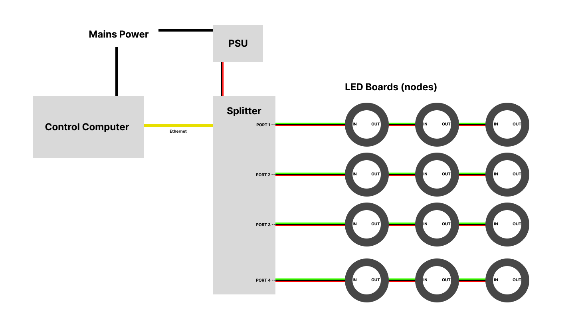

# JBS Technical Challenge

## Challenge 1 

### System Diagram

### Recommended Power Supply

**LED Boards Power**

(12 boards * 1 Amp) * 24 Volts = 288 Watts 

**Splitter Power**

24 Volts * 0.13 Amp = 3.12 Watts

**Total Power**

288 + 3.12 = 291.12 Watts 

291.12 Watts / 24 Volts = 12.13 Amps 

Recommended power supply for 12 boards with a single splitter = 24v (DC) 13 Amps (312 Watts)

## LED Control Script 
<a href="./scripts/LEDboard.py">Control Script</a>

Here python's built in socket module has been used to send UDP packets over a network. RGBW LED values are mapped to different ports based on the data structure of colour message. Attempts have been made to make this scalable by taking an object oriented and modular approach; ensuring that multiple splitters could be used and synchronised. 

## LED Test Script 

Unittest module has been used to instantiate the LEDboard class and run two test methods.
One method simulates a single splitter using 4 channels with 3 boards chained in each channel.
As the final piece is expected to be 50m in length, it's likely more than one splitter will be required, so a second method simulates the use of three splitters with the same channel/board configuration as the first method.

The test script sets the debug attribute in the LEDboard class to True to print the packet values. It also sets the IP base to 125.0.0. to allow for further terminal debugging through use of a test server that listens for UDP packets and prints the received information - this proved to be very useful in debugging. For testing with splitters, do not change the IP base attribute. 

## Challenge 2

